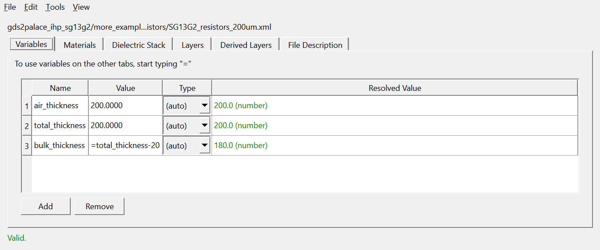

# What's New - August 18, 2026

Changes since the version from about 3 months ago, focused on features that matter to end users. For general usage, see the main [README](../README.md).

## Variables tab in the Stackup Editor

The Stackup Editor now has a **Variables** tab for defining named values (plain numbers/text, or `=expression` referencing other variables) that can be reused across the whole stackup file. Type `=` into any numeric-capable cell on the other tabs to get an autocomplete list of declared variables.

This matches the `<Variables>`/`"=expr"` XML format gds2palace's stackup reader supports as of `schemaVersion="3.1"` - see the [XML stackup format doc](https://github.com/VolkerMuehlhaus/gds2palace_ihp_sg13g2/blob/main/doc/XML_stackup_format/XML_stackup_format.md) for the underlying format. Existing files and scripts that don't use Variables are unaffected.

## setupThermal: a new companion app for thermal simulation

setupEM now installs a second program, **setupThermal**, alongside setupEM. It provides the same kind of guided, tabbed interface as setupEM, but for building thermal simulation models instead of S-parameter models.

- Uses the [Elmer](https://www.elmerfem.org/blog/) FEM solver instead of AWS Palace. Elmer must be installed separately.
- Reuses the same gds2palace stackup workflow as setupEM, so layout and stackup files work the same way.
- Start it the same way as setupEM: with your venv activated, simply type `setupThermal`.

## New Stackup Editor

A new graphical **Stackup XML Editor** is available from the **Tools > Edit Stackup XML...** menu in both setupEM and setupThermal. Previously, stackup XML files had to be edited by hand in a text editor.

The editor lets you manage all parts of a stackup file:
- **Materials** (dielectrics and metals, including color coding)
- **Dielectric stack** (layer order and thickness)
- **Drawn layers** (the GDSII layers used for geometry)
- **Derived layers**: new boolean/resize operations (AND, OR, NOT, grow/shrink) that combine or modify existing drawn layers to create additional layers, without needing a separate layout preprocessing step

Edits are shown live in a cross-section preview, the same visualization used by "Show stackup" elsewhere in the app. Saving preserves any comments and formatting in the original XML file that the editor doesn't touch.

## Reference-relative stackup positioning

The Stackup Editor's Dielectric Stack and Layers tabs now support an additional way to position a layer: instead of an absolute Zmin/Zmax, a Dielectric or Layer can reference the top or bottom edge of another one, with an offset. This means a stack no longer needs every z-position hand-recomputed whenever a Dielectric's thickness changes - layers positioned this way track the change automatically. The Result columns show the resolved absolute position either way, so it's always visible regardless of which mode a row uses.

Use **Tools > Convert to Reference position format** in the Stackup Editor to convert an existing stackup file (using absolute positions) to this format in place; the physical layer positions stay exactly the same, only how they're expressed in the XML file changes.

Files using this feature require the newer `schemaVersion="3.0"` stackup format. If you save changes to an older-format file that has since been converted, the editor will ask whether to overwrite the original file or save the upgraded version separately, so an old-format file is never silently replaced. You may also see a console/log warning from gds2palace if a stackup file declares a newer schema version than your installed gds2palace version supports.
